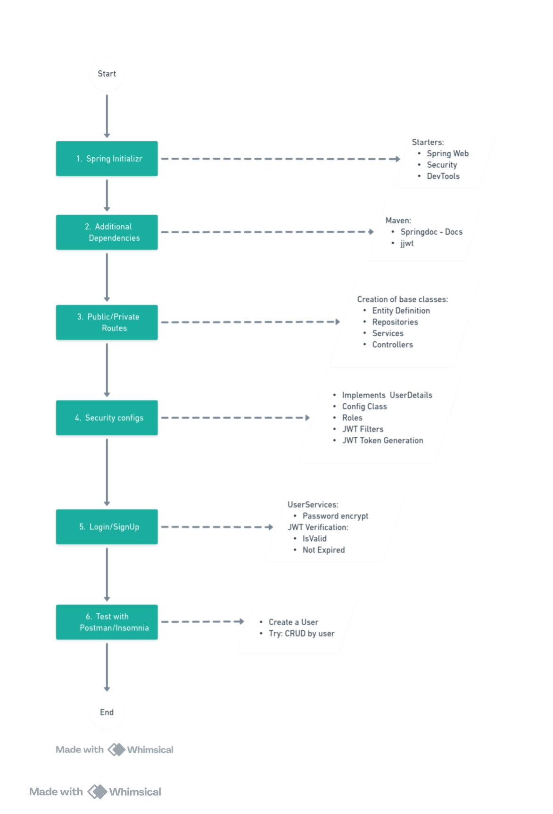
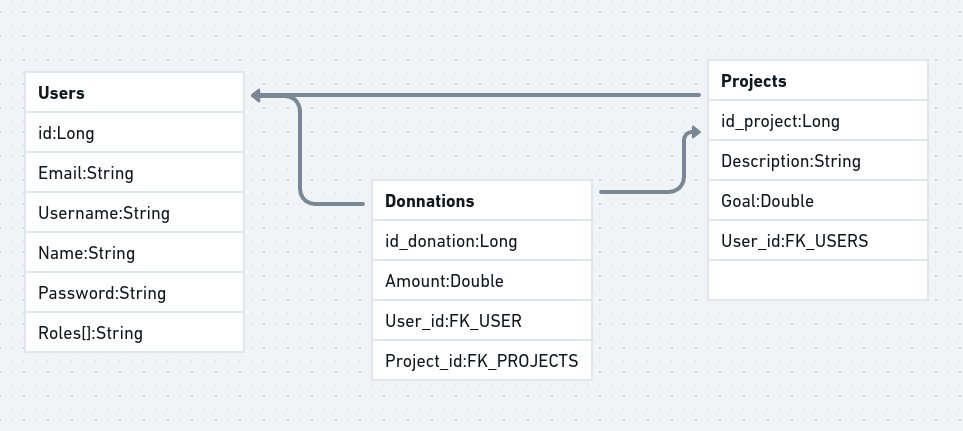

# Crowdfunding API Project with JWT Authentication

This is a sample project for a crowdfunding API, aimed at demonstrating JWT authentication implementation using Spring Boot. It includes basic functionalities for managing users, projects, and donations.

## 1. Project Objective

Create a simple crowdfunding API that illustrates the use of JWT authentication to secure endpoints. The project includes basic CRUD operations for `users`, `projects`, and `donations`, allowing for the management of these entities in a donation campaign context.

## 2. Technologies Used

- **Spring Boot** (web, devtools, security)
- **JWT** for authentication
- **H2 Database** for in-memory database
- **Java JSON Web Token (jjwt)** for JWT creation and verification

## 3. Endpoints and Functionalities

### Users - `/api/v1/users`
- `GET /all`: Lists all users
- `GET /{id}`: Retrieves a user by ID
- `POST /create`: Creates a new user
- `PUT /update/{id}`: Updates an existing user
- `DELETE /delete/{id}`: Deletes a user

### Authentication - `/api/v1/auth`
- `POST /signup`: Registers a new user
- `POST /login`: Authenticates a user and generates a JWT token

### Projects - `/api/v1/project`
- `GET /all`: Lists all projects
- `GET /{id}`: Retrieves a project by ID
- `POST /create`: Creates a new project
- `PUT /update/{id}`: Updates an existing project
- `DELETE /delete/{id}`: Deletes a project
- `GET /user/{id}`: Filters projects for a specific user

### Donations - `/api/v1/donation`
- `GET /all`: Lists all donations
- `GET /{id}`: Retrieves a donation by ID
- `POST /create`: Creates a new donation
- `PUT /update/{id}`: Updates an existing donation
- `DELETE /delete/{id}`: Deletes a donation
- `GET /user/{id}`: Filters donations for a specific user
- `GET /project/{id}`: Filters donations received for a specific project

## 4. JWT Authentication Implementation

JWT authentication was implemented following [this tutorial](https://medium.com/@tericcabrel/implement-jwt-authentication-in-a-spring-boot-3-application-5839e4fd8fac) by Teric Cabrel. JWT is used to secure endpoints and manage authenticated user access to the API.

## 5. Package Structure

The project follows the **DDD (Domain-Driven Design)** pattern to organize its packages, facilitating future maintenance and expansion.

## 6. Structure and Diagram

The overall flow and the entity relationships can be visualized in the files located in `./data`:
- **Flowchart** - : Displays the initial project planning.
- **ERD** - : Shows the entity-relationship diagram between `users`, `donations`, and `projects`.

## 7. Running the Project

To run the project locally:

1. Clone the repository and navigate to the project folder.
2. Install dependencies using Maven:

    ```bash
    mvn clean install -U
    ```

3. Start the Spring Boot server:

    ```bash
    mvn spring-boot:run
    ```

The project will be available at `http://localhost:8080`.

-----------------------------
# PT-BR # Projeto de API de Crowdfunding com Autenticação JWT

Este é um projeto de exemplo para uma API de crowdfunding, com o objetivo de demonstrar a implementação de autenticação JWT usando Spring Boot. Ele conta com funcionalidades básicas para gerenciar usuários, projetos e doações.

## 1. Objetivo do Projeto

Criar uma API simples de crowdfunding que exemplifique o uso de autenticação JWT para proteger endpoints. O projeto inclui as operações básicas de CRUD para `usuários`, `projetos` e `doações`, permitindo o gerenciamento dessas entidades em um cenário de doações para campanhas.

## 2. Tecnologias Utilizadas

- **Spring Boot** (web, devtools, security)
- **JWT** para autenticação
- **H2 Database** para banco de dados em memória
- **Java JSON Web Token (jjwt)** para criação e verificação de tokens JWT

## 3. Endpoints e Funcionalidades

### Usuários - `/api/v1/users`
- `GET /all`: Lista todos os usuários
- `GET /{id}`: Recupera um usuário pelo ID
- `POST /create`: Cria um novo usuário
- `PUT /update/{id}`: Atualiza um usuário existente
- `DELETE /delete/{id}`: Remove um usuário

### Autenticação - `/api/v1/auth`
- `POST /signup`: Registra um novo usuário
- `POST /login`: Autentica um usuário e gera um token JWT

### Projetos - `/api/v1/project`
- `GET /all`: Lista todos os projetos
- `GET /{id}`: Recupera um projeto pelo ID
- `POST /create`: Cria um novo projeto
- `PUT /update/{id}`: Atualiza um projeto existente
- `DELETE /delete/{id}`: Remove um projeto
- `GET /user/{id}`: Filtra projetos de um usuário específico

### Doações - `/api/v1/donation`
- `GET /all`: Lista todas as doações
- `GET /{id}`: Recupera uma doação pelo ID
- `POST /create`: Cria uma nova doação
- `PUT /update/{id}`: Atualiza uma doação existente
- `DELETE /delete/{id}`: Remove uma doação
- `GET /user/{id}`: Filtra as doações de um usuário específico
- `GET /project/{id}`: Filtra as doações recebidas para um projeto específico

## 4. Implementação de Autenticação JWT

A autenticação JWT foi implementada seguindo o [tutorial](https://medium.com/@tericcabrel/implement-jwt-authentication-in-a-spring-boot-3-application-5839e4fd8fac) de Teric Cabrel. O JWT é usado para proteger endpoints e gerenciar o acesso de usuários autenticados à API.

## 5. Estrutura de Pacotes

O projeto segue o padrão **DDD (Domain-Driven Design)** para organizar seus pacotes, facilitando a manutenção e expansão futura.

## 6. Estrutura e Diagrama

O fluxo geral e o relacionamento entre as entidades podem ser visualizados nos arquivos localizados em `./data`:
- **Fluxograma** - : Exibe o planejamento inicial do projeto.
- **DER** - : Mostra o diagrama entidade-relacionamento entre `users`, `donations` e `projects`.

## 7. Execução do Projeto

Para rodar o projeto localmente:

1. Clone o repositório e navegue até a pasta do projeto.
2. Instale as dependências usando Maven:

    ```bash
    mvn clean install -U
    ```

3. Inicie o servidor Spring Boot:

    ```bash
    mvn spring-boot:run
    ```

O projeto estará disponível em `http://localhost:8080`.

---
